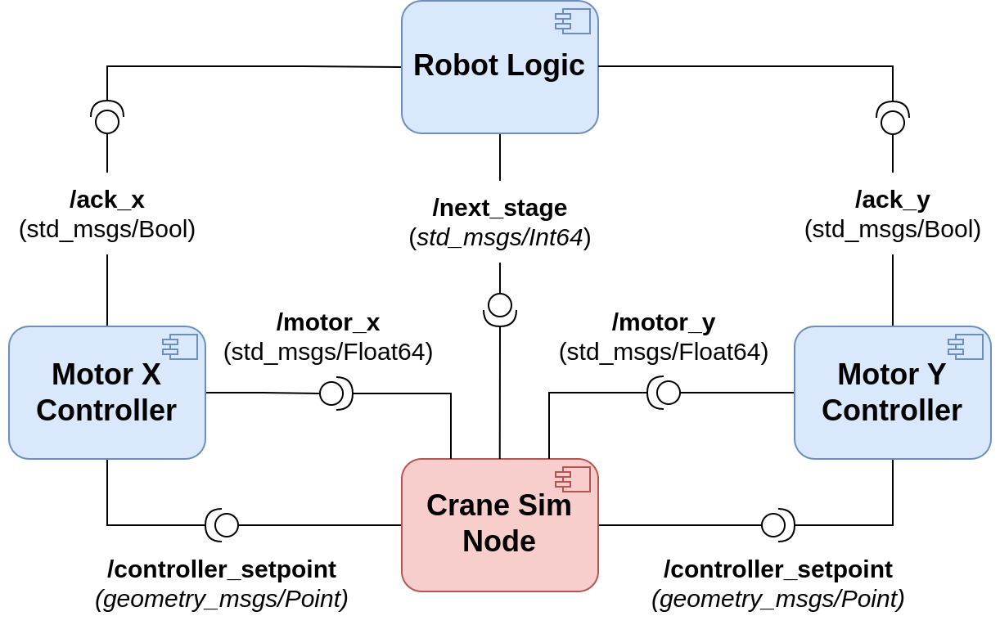

# ROS2 Crane-Simulator
This is the second assignment for the "Software Architecture for Robotics" course at the University of Genoa. The project consists of a 2D simulation of a crane, performing pick and place operations. Implementation is done in ROS2/Python with the help of the Arcade library. The simulation node is already developed and provided by [@SimoneMacci0](https://github.com/SimoneMacci0). The controller nodes and the robot logic node have been implemented as part of the assignment deliverables.

## Dependencies

The project targets ROS2 distributions. It has been successfully tested with Galactic and Humble distros (desktop installation).

The only external depencency needed is Arcade library (see [Instructions for Linux install](https://api.arcade.academy/en/latest/install/linux.html))

## Execution

Clone the repository in your workspace and compile as usual.

Run the full simulation using the command:

```bash
ros2 launch ros2_craneSim_SoFaR_UniGe ros2_craneSim_SoFaR_UniGe.launch.py
```

The repository structure is as follows:

```bash
.
`-- ros2_craneSim_SoFaR_UniGe
    |-- launch
    |   `-- ros2_craneSim_SoFaR_UniGe.launch.py
    |-- package.xml
    |-- resource
    |   |-- SOFAR-assign1-architecture.png
    |   |-- beam_horizontal.png
    |   |-- beam_top_left.png
    |   |-- beam_top_right.png
    |   |-- beam_vertical.png
    |   |-- chain.png
    |   |-- container.png
    |   |-- hook.png
    |   `-- ros2_craneSim_SoFaR_UniGe
    |-- ros2_craneSim_SoFaR_UniGe
    |   |-- __init__.py
    |   |-- crane_sim_node.py
    |   |-- lib
    |   |   |-- __init__.py
    |   |   `-- crane_sim.py
    |   |-- motor_x_controller.py
    |   |-- motor_y_controller.py
    |   `-- robot_logic.py
    |-- setup.cfg
    |-- setup.py
    `-- test
        |-- test_copyright.py
        |-- test_flake8.py
        `-- test_pep257.py

```

## Assignment and Nodes Details

The following architecture, made up of 4 nodes, has been implemented:
1) The **simulation node** is already provided with this repository. It publishes a single topic (**/controller_setpoint**), which holds the (x,y) goal coordinates for the crane's end-effector. The controller setpoint depends on the current stage of the pick-and-place and a new setpoint is published whenever the simulation node receives messages on the **/next_stage** topic. You can easily inspect the various stages of the pick-and-place inside the source code of the simulation node. Finally, the node subscribes to **/motor_x** and **/motor_y** topics, which respectively hold the updated (x,y) end-effector coordinates returned by the control loop.
2) The **controller nodes**, which implement a simple PID controller to control, respectively, the horizontal and vertical motor of the crane. Currently, I have implemented my own controller. A further update will include also an already available one (e.g., [simple-pid-python](https://pypi.org/project/simple-pid/)).
The controllers receive the target position on the **/controller_setpoint** topic and activate the control loop to drive the crane's end-effector, publishing the corresponding updated position on their respective topic. Whenever the target position is reached, the control loop stops and the controller publishes an acknowledgment message on the corresponding topic.
3) The **robot logic node**, which acts has *high-level controller*, guiding the crane through the stages of the pick-and-place. The node waits for both controllers to be idle, then publishes the next stage of the pick-and-place on the given topic. 
Each pick-and-place action begins with the PICK stage (thus you will need to publish a **std_msgs/Int64** message with the data field set to 1) and concludes with the DROP stage, where the current container is delivered and a new one will spawn inside the simulation, increasing your overall score.



## Expected Output

<!-- Include a GIF of the simulation in action, present in this directory as output.gif -->


## Troubleshooting

As of ROS2 Humble, there is a weird bug which prevents the application from being launched correctly unless the ```import arcade``` statement is placed as first. Whatever changes you do in the code, make sure to always keep that import as first line of code.


Thanks to [@SimoneMacci0]((https://github.com/SimoneMacci0) for developing the base architecture of the simulation. Refer to his repository for further details on the simulation node: [sofar-crane-simulator](https://github.com/SimoneMacci0/sofar-crane-simulator)